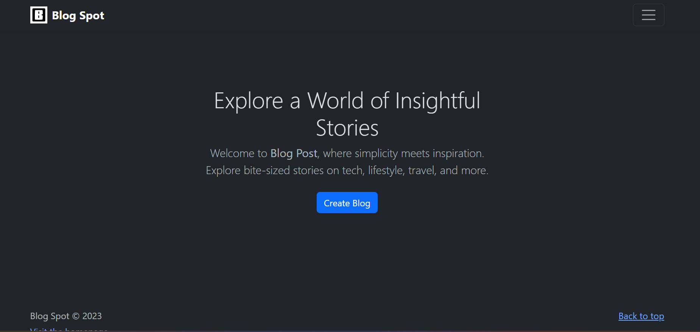
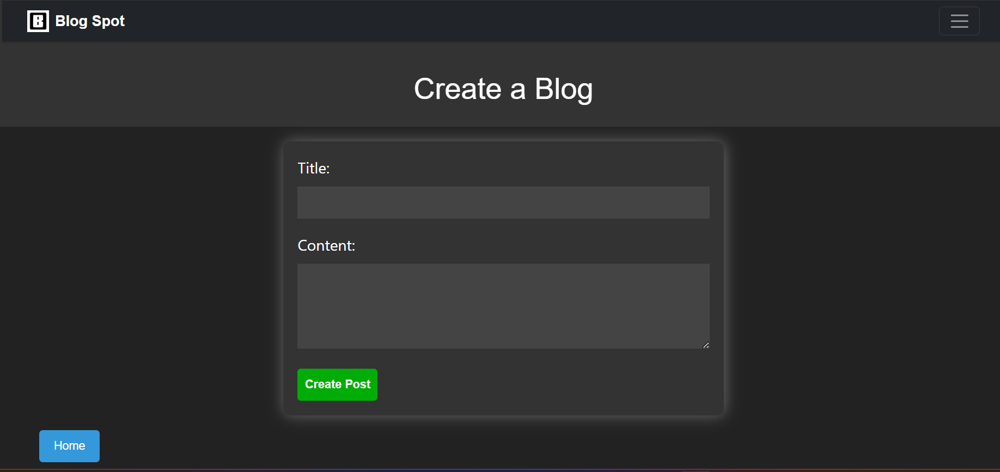

# Blog Spot

Our blog website is a platform for sharing insightful articles, engaging stories, and thought-provoking content. Whether it's crafting a new post, updating an existing one, or cleaning up outdated content, the power is now at the fingertips.



## Introduction
This blog is not just a static space on the internet; it's a dynamic reflection of my tech journey.
I invite each one of you to join me in this adventure. Share your thoughts, insights, and feedback. Let's build a community around technology, coding, and the endless possibilities that come with it.


## Installation

Below is the step-by-step instructions on how to install and set up my project.

```bash
git clone https://github.com/sdevam6990/Blog-Website.git
cd Blog-Website
npm install
node index.js
